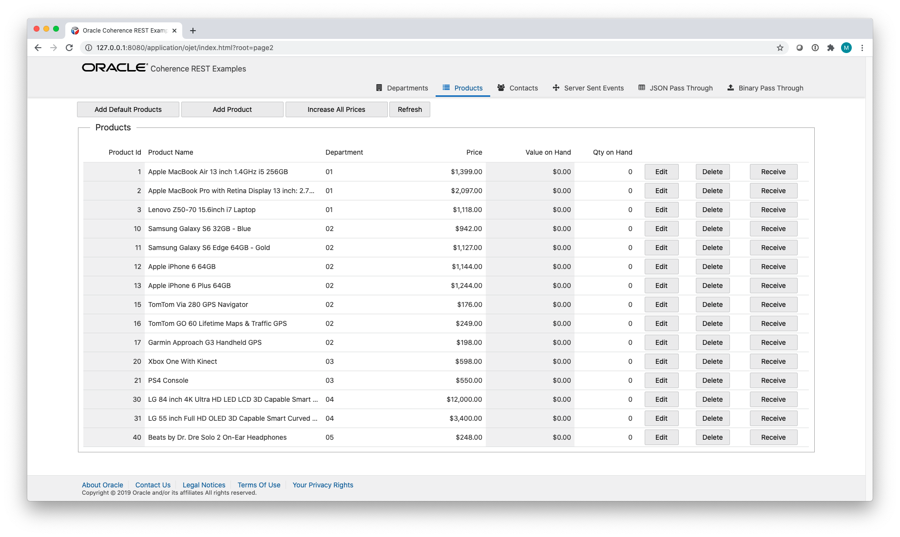

# Coherence Examples

  

# Overview

This document describes various examples showing how to accomplish common tasks using Coherence Community (CE).

Some of the examples are externally hosted on other GitHub repositories and others are included under various sub-directories.

> Note: These examples are provided for educational and demonstration purposes only; they are not intended to be used in production deployments or to be depended upon to create production environments.

# Table of Contents

1. [Coherence Demo](#coherence-demo)
1. [Helidon Sock Shop](#helidon-sock-shop)
1. [Coherence REST Example](#coherence-rest-example)
1. [To Do List](#to-do-list)

## 1. Coherence Demo

This demonstration application showcases Coherence general features and scalability capabilities including:

* Clustering and Data Sharding
* Scalability and High Availability
* Disk-Based Persistence
* Parallel Queries
* Efficient Aggregation
* In-Place Processing
* Federation (Grid Edition feature only)
* Lambda Support
* OpenTracing Support

This demonstration can be run locally using `java -jar` or can be run on Kubernetes using the [Coherence Operator](https://github.com/oracle/coherence-operator).

GitHub Location: https://github.com/coherence-community/coherence-demo

##  2. Helidon Sock Shop

This project is an implementation of the microservices based application using [Helidon Microservices Framework](https://helidon.io/).

The application is an online store that sells, well, socks, and is based on the canonical [SockShop Microservices Demo](https://microservices-demo.github.io) originally written and published under Apache 2.0 license by [Weaveworks](https://go.weave.works/socks).

GitHub Location: https://github.com/helidon-sockshop/sockshop

##  3. Coherence REST Example

This example shows a basic application built using Oracle JavaScript Extension Toolkit (JET) and how Coherence REST endpoints can be integrated into such an application.

Location: [Coherence REST Example](rest)

##  4. To Do List

This example contains a set of simple task management examples written in various languages to showcase Coherence CE.

It is an extension of the [Quick Start](https://coherence.community/index.html#quickstart) that adds various client implementations (React.js, Oracle JET, JavaFX), as well as the additional REST API implementation (Node.js/Express). It demonstrates how the same Web Server that is used to host REST API can be used to serve modern static web front ends.

This application showcases:
* Integration with Helidon
* Integration with Node.js/Express
* Client-side Events
* React and Oracle JET Web Front End access as well as JavaFX Client

GitHub Location: https://github.com/coherence-community/todo-list-example
