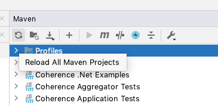

///////////////////////////////////////////////////////////////////////////////
    Copyright (c) 2000, 2021, Oracle and/or its affiliates.

    Licensed under the Universal Permissive License v 1.0 as shown at
    http://oss.oracle.com/licenses/upl.
///////////////////////////////////////////////////////////////////////////////
= Creating Guides and Tutorials
:description: Create Coherence Guides
:keywords: coherence, java, documentation
:toc:

// DO NOT remove this header - it might look like a duplicate of the header above, but
// both they serve a purpose, and the docs will look wrong if it is removed.
== Creating Guides and Tutorials

This document is a guide to creating Coherence guides and tutorials.

== Setup

The first set of tasks before writing anything is to set up the directory structure for your example
and add it to the Coherence source and docs.

All tutorials are written in asciidoc format.
See the AsciiDoc documentation for how to use AsciiDoc https://docs.asciidoctor.org/asciidoc/latest/
or look at the other *.adoc files in the guides and tutorials.

=== Prerequisites

To make life easier install the `AsciiDoc` plugin into IntelliJ.
This plugin understands asciidoc, can show you a real time view of what your doc will look like
and has lots of clever auto-completions.

=== A Guide or a Tutorial

The first step is to decide whether you are writing a short guide or a tutorial.

* Guides - typically designed to take around in 15-30 minutes to complete.
A guide provides simple, hands-on instructions for building a basic "Hello World" type of scenario
for a specific Coherence feature or API.
In most cases, the only prerequisites are `coherence.jar`, maybe another Coherence library, a JDK and a text editor.

* Tutorials - typically designed to take a longer time to complete than guides, maybe an hour or longer.
Tutorials provide deeper, in-context look at larger Coherence features, APIs or application development topics,
applicable to implement real-world solutions.

When you have decided which category your example is in, that will determine where in the directory structure
it will live, under `prj/examples/guides` or `prj/examples/tutorials`.

=== Directory Naming

The name of the directory that the example will be created in should be relevant to the example subject.

All directories start with a numeric prefix. This is used to determine where the example will appear in the
documentation left-hand navigation panel. The ascii doc processing will create the navigation in alphabetical
order of the directory names, so using a numeric prefix allows us to accurately control ordering.

Decide where in the order your example should go and use an appropriate prefix.
Related examples should go together, for example all CDI examples should be in consecutively numbered directories to
keep them together in the navigation.
Ideally leave a gap of 10 between the previous example and your new example.
In the guides section simpler more fundamental API guides go earlier in the list.
For tutorials the order is not so important, but again, more fundamental Coherence core topics should come earlier
than examples about add-ons and third-party integrations.

=== Copy the Template

To make starting your example a bit simpler, there is a template directory that can be copied to the directory
that your example will be in.
Copy the contents of the `prj/examples/internal/template` directory into your example's directory and add all
the files to source control.

=== Rename the Template Contents

Various parts of the content of the copied template files will need to be changed for your specific example.

==== pom.xml

In the `pom.xml` file change the `<artifactId>` value from `sample` to something relevant to your example.
Change the value of the `<name>` element from `Coherence Guides - Sample` to something relevant to your example.

==== settings.gradle

In the `settings.gradle` file change the `rootProject.name` property from `sample` to the same value used for
the `artifactId` in the `pom.xml` file.

==== README.adoc

The `README.adoc` file is where the example text will be written, the entire guide or tutorial should be a single page.

Change the heading lines `= Title` and `== Title` to be the title of your example.

[NOTE]
====
The first title, prefixed with a single equals sign, `= Title` is what will appear in the left-hand navigation
panel of the documentation. Do not make this title too long, or it will not make sense as it will be truncated.
You can typically fit at most 25 or 30 characters.
Related examples should have a similar title prefix, e.g. all CDI example might have a title starting `CDI - `
so that they look better in the navigation.
====

Usually the second title, `== Title` is the same as the first title, but does not have to be.
This is the title that will appear at the top of the page in the documentation.

=== Add the Example to the Coherence Build

All examples are built and tested as part of the Coherence CI build.
Add the directory that you created to the `<modules>` section of the `prj/examples/pom.xml` file.

If you refresh the Maven projects in IntelliJ your new example directory should appear as a new module.

=== Add the Example to the Documentation

A link for your new example needs to appear in the documentation.

For a new guide add a new `[CARD]` section to the `examples/guides/README.adoc` file

  [CARD]
  .Short Title...
  [link=examples/guides/<guide-directory-name>/README.adoc]
  --
  A suitable short description...
  --

For a new tutorial add a new `[CARD]` section to the `examples/tutorials/README.adoc` file

  [CARD]
  .Short Title...
  [link=examples/tutorials/<tutorial-directory-name>/README.adoc]
  --
  A suitable short description...
  --

== Writing the Example

Now that the infrastructure for your example is set up you can actually write the documentation and source code.

=== Examples Must be Testable

An important requirement for examples is that any source code they include is buildable and testable.
The example source is written as a combination Maven and Gradle project (because for some reason Gradle is popular).

The examples have a dependency on JUnit 5 so this should be used for tests, do not change this to JUnit 4.
If you need to use other test dependencies, like Mockito, Hamcrest, Bedrock, etc you will need to add the dependencies
(see the <<#deps,Adding Dependencies>> section below)

All source code that appears in the example should be real code in source files rather than just typed directly into
the `README.adoc` (more on the mechanics of this below).

Some examples may be written as just a set of unit tests, for example something as simple as a guide to a couple
of `NamedCache` API methods does not make sense as a complicated set of classes, it can easily be demonstrated
as unit tests. These tests are then executed as part of the Coherence CI build to ensure the examples are not broken.

More complex examples and especially tutorials might need to be written more like mini applications.
For these examples some proper tests should be written to verify that the steps and instructions given in the example
`README.adoc` actually work.

=== Document Structure

We want to try to keep the example document structure consistent.
The `README.adoc` file in the template directory is already in the common format, the comments should make it
simple to see where to add your own text.

[#deps]
=== Adding Dependencies

The template depends on `coherence` and `JUnit 5`, if your example requires other dependencies you will need to
add them to the Maven `pom.xml` and Gradle files.

==== Update the POM File

Add dependencies to the example's `pom.xml` just like any other dependency in Coherence. When adding dependencies to the `pom.xml` file, you should also define a version variable for that dependency in the `properties` section.

For example to add a test dependency on Mockito just add the following to the `pom.xml`:
[source,xml]
----
<dependency>
    <groupId>org.mockito</groupId>
    <artifactId>mockito-core</artifactId>
    <version>${mockito.version}</version>
    <scope>test</scope>
</dependency>
----

==== Update the Gradle Files

To add a dependency to the gradle project update the dependencies section of the `build.gradle` file.
The Gradle project also has an import dependency on the `coherence-bom` so there is no need to include versions when specifying dependencies on Coherence modules.
Version properties for other dependencies should be defined in the `gradle.properties` file, and if BOM for the dependency is available (as is the case with Helidon, for example) you should include dependency on BOM so you don't have to specify version for each individual dependency.

Make sure you use the correct scope for the dependency:

* Compile/Runtime Scope - For example to add a dependency on `helidon-microprofile-config`
[source,groovy]
----
implementation "io.helidon.microprofile.config:helidon-microprofile-config:${helidonVersion}"
----

* Test Scope - For example to add a test scoped dependency on Mockito:
[source,groovy]
----
testImplementation "org.mockito:mockito-core"
----

==== Coherence Module Dependencies

When adding dependencies on Coherence modules, you *must* use the Coherence GroupId variable as the GroupId.

* Maven - For example to add a dependency on Coherence Metrics
[source,xml]
----
<dependency>
    <groupId>${coherence.group.id}</groupId>
    <artifactId>coherence-metrics</artifactId>
</dependency>
----

* Gradle - For example to add a dependency on Coherence Metrics
[source,groovy]
----
implementation "${coherenceGroupId}:coherence-metrics"
----

==== Specifying Dependencies in the README.adoc

When describing additional dependencies in the `README.adoc` file show both the Maven format and Gradle format.

* Maven

  [source,xml]
  ----
  <dependency>
      <groupId>${coherence.group.id}</groupId>
      <artifactId>coherence-metrics</artifactId>
  </dependency>
  ----

* Gradle

  [source,groovy]
  ----
  implementation "com.oracle.coherence:coherence-metrics"
  ----

=== Include Code in the `README.doc`

Source code from the examples should be imported into the `README.doc` using an `include` macro.
This ensures that if the example code is refactored that the documentation always contains the correct code.

Text from any source file can be included in the `README.adoc` file. Just add tag comments around the snippet
of source to be included and specify the tag in the include macro.

For example.

[source,java]
.src/main/java/com/oracle/coherence/examples/Main.java
----
public class Main
    {
    // # tag::foo[]
    public static void main(String[] args)
        {
        }
    // # end::foo[]
    }
----

The file above is located at `src/main/java/com/oracle/coherence/examples/Main.java` in the example source code.
The `main` method is surrounded by tag comments with the tag name `foo`

This can then be included in the `Readme.adoc` file using the asciidoc format shown below:

 [source,groovy]
 ----
 include::src/main/java/com/oracle/coherence/examples/Main.java[tag=foo]
 ----

See the asciidoc documentation for more help on includes https://docs.asciidoctor.org/asciidoc/latest/directives/include/

=== Version Numbers and other Build Properties

When including version numbers in the `README.adoc`, use the document attributes so that they are pulled in at
build time from asciidoc attributes. The attributes are specified in the `attributes` section at the top of
the `prj/docs/sitegen.yaml`.

For example, the current Coherence version is an attribute named `version-coherence` which is set from the
`${project.version.official}` Maven build property. To include this in an asciidoc file just put the attribute name
in curly-brackets.

If the `project.version.official` property is `14.1.2.0.0` then the text
  `The current version is {version-coherence}`
will render as `The current version is 14.1.2.0.0`

See the asciidoc documentation on attributes: https://docs.asciidoctor.org/asciidoc/latest/attributes/document-attributes/

You can add more global attributes to the `sitegen.yaml` if required.

== Perforce Integrations

Assuming that you write the example in the P4 commercial branch the example will need to be integrated into the
relevant CE branch. When doing this, there are some changes that will be required to the integrated files *before*
they are submitted to P4.

=== Change Version Numbers

The Coherence version numbers in the `pom.xml` and `gradle.properties` files will need to be changed to
the correct CE version.

For example if the commercial version is `14.1.2-0-0-SNAPSHOT`, and the CE version is `21.06`:

* Change the `<revision>14.1.2-0-0-SNAPSHOT</revision>` property in the `pom.xml` file to `<revision>21.06</revision>`

* Change the `coherenceVersion=14.1.2-0-0-SNAPSHOT` property in the `gradle.properties` file to `coherenceVersion=21.06`

=== Change the Coherence GroupId

The Coherence groupId in the `pom.xml` and `gradle.properties` files will need to be changed to
the correct CE groupId.

* Change the `<coherence.group.id>com.oracle.coherence</coherence.group.id>` property in the `pom.xml` file
to `<coherence.group.id>com.oracle.coherence.ce</coherence.group.id>`

* Change the `coherenceGroupId=com.oracle.coherence` property in the `gradle.properties` file
to `coherenceGroupId=com.oracle.coherence.ce`

